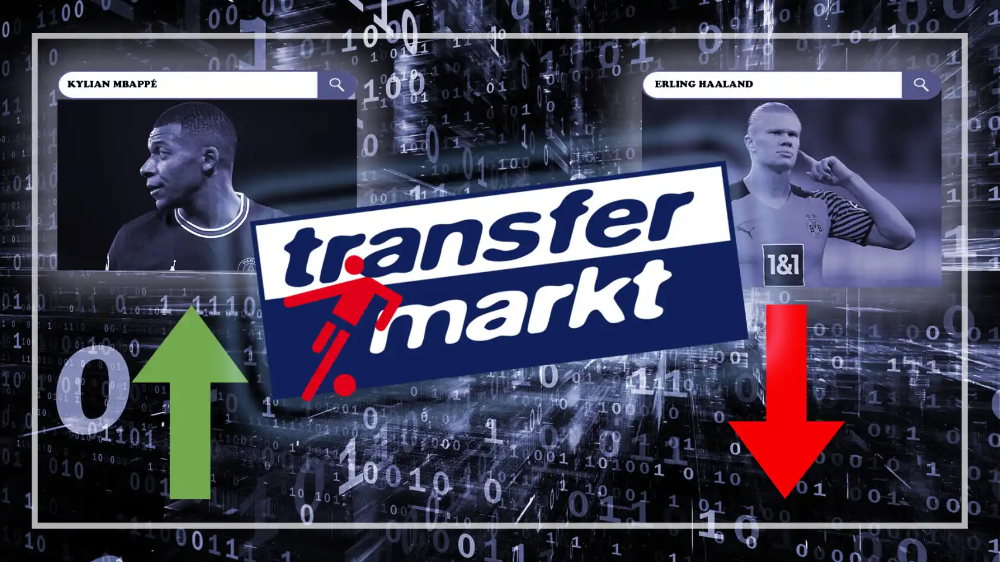

# Transfermarkt Analytics
 <br>


# Table of contents
<!-- vscode-markdown-toc -->
* I. [Introduction](#I.Introduction)
	* 1.1 [Overview](#Overview)
	* 1.2 [The goal of this project](#Thegoalofthisproject)
	* 1.3 [Prerequisites](#Prerequisites)
	* 1.4 [Dependencies](#Dependencies)
	* 1.5 [Data sources](#Datasources)
* II. [Architecture](#II.Architecture)
* III. [How It Works](#III.HowItWorks)
* IV. [Usage](#IV.Usage)
	* 4.1 [Prepare infrastructure](#Prepareinfrastructure)
	* 4.2 [Prepare MySQL data](#PrepareMySQLdata)
	* 4.3 [Prepare Medallion Architecture](#PrepareMedallionArchitecture)
	* 4.4 [Prepare dbt-trino](#Preparedbt-trino)
	* 4.5 [Transform MySQL data To DataLake (Minio)](#TransformMySQLdataToDataLakeMinio)
	* 4.6 [Build Data Warehouse (GCP)](#BuildDataWarehouseGCP)
	* 4.7 [Build Data Lakehouse (Dremio)](#BuildDataLakehouseDremio)
	* 4.8 [Connect S3 and GCP in DataLakehouse](#ConnectS3andGCPinDataLakehouse)
		* 4.8.1 [Connect S3](#ConnectS3)
		* 4.8.2 [Connect GCP](#ConnectGCP)
	* 4.9 [Load Data from Data-Lake to Data-Warehouse](#LoadDatafromData-LaketoData-Warehouse)
* V. [Visualization](#V.Visualization)

<!-- vscode-markdown-toc-config
	numbering=true
	autoSave=true
	/vscode-markdown-toc-config -->
<!-- /vscode-markdown-toc -->


##  <a name='I.Introduction'></a>I. Introduction
    
###  1.1 <a name='Overview'></a>Overview
- This project aims to provide an in-depth analysis of Real Madrid's performance during the 2022/2023 season using data from Transfermarkt. The dataset includes various metrics such as:  
    - Performance Analysis: Evaluate Real Madrid's overall performance in different competitions (La Liga, Champions League, Copa del Rey).
    - Player Analysis: Assess individual player contributions, including goals, assists, defensive actions, and other relevant metrics.
    - Transfer Analysis: Analyze the impact of player transfers on the team's performance and financial health.

###  1.2 <a name='Thegoalofthisproject'></a>The goal of this project
- Data-Driven Decision Making: Equip Real Madrid’s management with data-backed insights to make informed decisions regarding team strategy, player acquisitions, and financial management.
- Enhanced Performance: Identify key areas for improvement that can lead to better performance in future seasons.
- Fan Engagement: Offer fans a detailed and transparent view of the team's performance and management, fostering greater engagement and support.

By achieving these objectives, the project aims to contribute to Real Madrid's long-term success both on and off the field, ensuring the club remains competitive

###  1.3 <a name='Prerequisites'></a>Prerequisites
<p align="center">
  <a >
    
  </a>
</p>

    Before you continue, ensure you meet the following requirements:

        * You have installed Python.
        * You have a basic understanding of Docker (docker-compose, docker network, docker images,...). 
        * You have a basic understanding of medallion architecture (bronze, silver, gold).
        * You understand the basics of dbt, trino
        * You have a basic understanding of infrastructure as code (Terraform)
        * Knowledge of data lake, data warehouse

###  1.4 <a name='Dependencies'></a>Dependencies
    This project uses the following libraries:

    - dbt-trino, dbt-core: an adapter for dbt (data build tool) that allows it to work with Trino, a distributed SQL query engine.It enables users to run dbt models, tests, and snapshots against Trino databases.

    - pandas: is a powerful, flexible, and easy-to-use open-source data analysis and manipulation library for Python. It provides data structures like DataFrames, which allow for complex data analysis and manipulation.

    - pyspark: is the Python API for Apache Spark, a fast and general-purpose cluster computing system. It allows for large-scale data processing and machine learning.

    - jinja2: is a templating engine for Python. It is used for rendering templates, allowing for the creation of dynamic HTML or other text formats.

    - mysql.connector.python: is the official MySQL driver written in Python.It provides a Python interface for connecting to a MySQL database and executing SQL queries.

    - minio: is a Python client for MinIO, an object storage server.It allows Python applications to interact with MinIO and Amazon S3 compatible cloud storage services.

###  1.5 <a name='Datasources'></a>Data sources
The dataset is composed of multiple CSV files with information on competitions, games, clubs, players and appearances that is automatically updated once a week.

The dataset used
> **Online Transfermarkt Record Data:**
> 
> Link website: https://www.kaggle.com/datasets/davidcariboo/player-scores


## <a name='II.Architecture'></a>II. Architecture


<br />

## <a name='III.HowItWorks'></a>III. How It Works

1. Data Collection and Storage:

    - Data related to Transfermarkt is collected in the form of CSV files.
    - These CSV files are imported into a MySQL database serving as the primary data source.

2. Data Transformation and Data Lake Creation:

    - The data in MySQL is transformed into a Data Lake using dbt-trino.
    - The Data Lake is structured into three layers: Bronze, Silver, and Gold.
        - Bronze Layer: Raw data ingested without any processing.
        - Silver Layer: Processed data with basic cleaning and transformation.
        - Gold Layer: Refined and optimized data ready for analytics and reporting.

3. Data Lakehouse Setup:
    - A Data Lakehouse is prepared to bridge connections between the Data Lake and Google Cloud Storage.
    - Dremio is chosen as the Data Lakehouse.
    - This setup facilitates seamless integration and storage of Data Lake data in the cloud.
   
4. Data Warehouse:
    - Data from the Gold layer of the Data Lake is prepared for the data warehouse.
    - Using Dremio, tables are created in the data warehouse by executing CREATE TABLE AS queries, effectively transferring refined data from the Data Lake to the data warehouse for further analysis and reporting.

5. Dashboard Creation with Tableau:
    - Tableau is connected to Google Cloud Storage to access the refined data stored in the data warehouse.

## <a name='IV.Usage'></a>IV. Usage
###  4.1 <a name='Prepareinfrastructure'></a>Prepare infrastructure
```bash
make build infrastructure
```

###  4.2 <a name='PrepareMySQLdata'></a>Prepare MySQL data
```sql
# copy CSV data to mysql container
# cd path/to/leagues_scorers/
docker cp ./transfermarkt/data/ de_mysql:/tmp/
docker cp ./mysql_schemas.sql de_mysql:/tmp/

# login to mysql server as root
docker exec -it [YourContainerId] bin/bash

# Once we are logged in, we can now login to mysql as root .
mysql --local-infile=1 -u root -p

CREATE DATABASE leagues_scorers;
USE leagues_scorers;
GRANT ALL PRIVILEGES ON *.* TO admin;


# We check status of LOCAL_INFILE
# LOAD DATA LOCAL INFILE is not enabled by default in MySQL, 
SHOW GLOBAL VARIABLES LIKE 'LOCAL_INFILE';


# If was started with --local-infile=0, LOCAL does not work. Then should be enabled it
SET GLOBAL LOCAL_INFILE=TRUE;


source /tmp/mysql_schemas.sql;
show tables;

LOAD DATA LOCAL INFILE '/tmp/data/competitions.csv' INTO TABLE competitions 
FIELDS TERMINATED BY ',' LINES TERMINATED BY '\n' IGNORE 1 ROWS;

LOAD DATA LOCAL INFILE '/tmp/data/games.csv' INTO TABLE games 
FIELDS TERMINATED BY ',' LINES TERMINATED BY '\n' IGNORE 1 ROWS;

LOAD DATA LOCAL INFILE '/tmp/data/clubs.csv' INTO TABLE clubs
FIELDS TERMINATED BY ',' LINES TERMINATED BY '\n' IGNORE 1 ROWS;

LOAD DATA LOCAL INFILE '/tmp/data/club_games.csv' INTO TABLE club_games 
FIELDS TERMINATED BY ',' LINES TERMINATED BY '\n' IGNORE 1 ROWS;

LOAD DATA LOCAL INFILE '/tmp/data/players.csv' INTO TABLE players
FIELDS TERMINATED BY ',' LINES TERMINATED BY '\n' IGNORE 1 ROWS;

LOAD DATA LOCAL INFILE '/tmp/data/appearances.csv' INTO TABLE appearances 
FIELDS TERMINATED BY ',' LINES TERMINATED BY '\n' IGNORE 1 ROWS;

LOAD DATA LOCAL INFILE '/tmp/data/player_valuations.csv' INTO TABLE player_valuations 
FIELDS TERMINATED BY ',' LINES TERMINATED BY '\n' IGNORE 1 ROWS;

LOAD DATA LOCAL INFILE '/tmp/data/game_events.csv' INTO TABLE game_events 
FIELDS TERMINATED BY ',' LINES TERMINATED BY '\n' IGNORE 1 ROWS;


SELECT * FROM competitions LIMIT 5;
SELECT * FROM games LIMIT 5;
SELECT * FROM clubs LIMIT 5;
SELECT * FROM club_games LIMIT 5;
SELECT * FROM players LIMIT 5;
SELECT * FROM appearances LIMIT 5;
SELECT * FROM player_valuations LIMIT 5;
SELECT * FROM game_events LIMIT 5;
```

###  4.3 <a name='PrepareMedallionArchitecture'></a>Prepare Medallion Architecture
```bash
trino> CREATE SCHEMA IF NOT EXISTS datalake.bronze WITH (location = 's3a://warehouse/bronze');
CREATE SCHEMA
trino> CREATE SCHEMA IF NOT EXISTS datalake.silver WITH (location = 's3a://warehouse/silver');
CREATE SCHEMA
trino> CREATE SCHEMA IF NOT EXISTS datalake.gold WITH (location = 's3a://warehouse/gold');
```
<br>
 <br>
<br>

###  4.4 <a name='Preparedbt-trino'></a>Prepare dbt-trino
```bash
    dbt init --profiles-dir ./ transfermarkt_analytics
    ## Choose connector is trino
    []: trino
```
```
    And now setup 3 folder following bronze, silver and gold bucket
```

###  4.5 <a name='TransformMySQLdataToDataLakeMinio'></a>Transform MySQL data To DataLake (Minio)
```bash
    make build data-lake
```
<br>
 <br>
<br>

_**Layer Bronze**_
<br>
 <br>
<br>

_**Layer Silver**_
<br>
 <br>
<br>

_**Layer Gold**_
<br>
 <br>
<br>


###  4.6 <a name='BuildDataWarehouseGCP'></a>Build Data Warehouse (GCP)
```bash
    make build data-warehouse
```
<br>
 <br>
<br>

###  4.7 <a name='BuildDataLakehouseDremio'></a>Build Data Lakehouse (Dremio)
```bash
    make build data-lakehouse
```

###  4.8 <a name='ConnectS3andGCPinDataLakehouse'></a>Connect S3 and GCP in DataLakehouse 
####  4.8.1 <a name='ConnectS3'></a>Connect S3
- Now you open Dremio at http://localhost:9047/
<br>
- Click on _**Add Source**_ at the bottom left 
- Then select _**Amazon S3**_ under Object Storage <br>
<br>
 <br>
<br>
- Fill in the details like the *Name* of the connector, *AWS Access Key*, *AWS Access Secret* and under Buckets, please add _**warehouse**_ as shown below <br>
<br>
 
<br>

- Next, choose the *Advanced Options* on the left side of the menu, click to *Enable compatibility* mode, and add 2 new Connection Properties <br>
    - fs.s3a.endpoint **:** minio:9000
    - fs.s3a.path.style.access **:** true 
<br>
<br>

<br>

####  4.8.2 <a name='ConnectGCP'></a>Connect GCP
- Click on _**Add Source**_ at the bottom left 
- Then select _**Google Cloud Storage**_ under Object Storage <br>
<br>
 
<br>

- Fill in the details like the *Authentication* of the connector. You choose _**Service Account Keys**_ and fill out field sush as _**Client Email**_, _**Client ID**_, _**Private Key ID**_, _**Private Key**_.<br>
<br>


<br>
- You must generate key from the service account to have the corresponding values ​​as above <br>
<br>


###  4.9 <a name='LoadDatafromData-LaketoData-Warehouse'></a>Load Data from Data-Lake to Data-Warehouse
You create a table in the Data Warehouse with data from the gold layer in the data lake with the syntax <a href="https://docs.dremio.com/current/reference/sql/commands/tables/#create-table-as" target="_blank">CREATE TABLE AS</a> <br>
<br>
  
<br>

Now, you check table in warehouse_football: 

   

<br>
  
<br>
<br>
Create the same with the remaining tables

<br>
  
<br>

##  <a name='V.Visualization'></a>V. Visualization

<br />